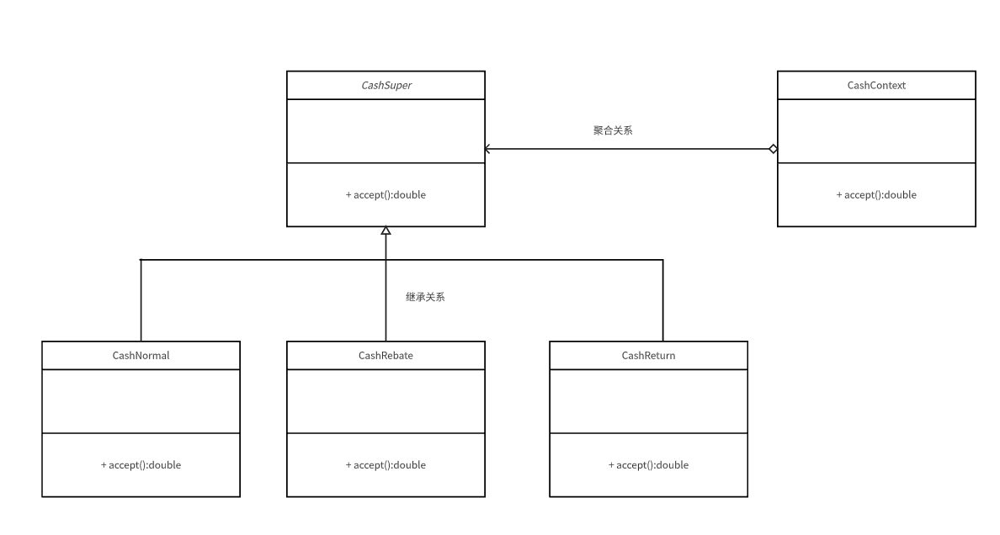

行为型模式

1.优点

提供创建对象的机制，能够提升已有代码的灵活性和可复用性

2.策略模式

案例：设计一个超市收银

首先不考虑规范。

```java
/**
 * 收银-如果使用if else肯定能实现多种折扣，但是也太不方便了
 * @author nisang
 * 2024/2/1 9:10
 * @version 1.0
 * Ruoyi-Cloud-Plus开发小组
 */

public class CashRegister {
    public static void main(String[] args) {
        Scanner sc = new Scanner(System.in);
        System.out.println("请输入折扣");
        //折扣
        double discount=Double.parseDouble(sc.next())/10;
        //数量
        System.out.println("请输入数量");
        int sum=Integer.parseInt(sc.next());
        //单价
        System.out.println("请输入单价");
        double price=Integer.parseInt(sc.next());
        //计算总价
        double v = (sum * price) * discount;
        System.out.println("总消费为："+v);
    }
}
```

当然如果是这样，后期如果打折或者满减优惠无法扩展，甚至耦合代码。

2.1UML类图



2.2策略模式

```java
/**
 * 收费抽象类
 * @author nisang
 * 2024/2/1 11:02
 * @version 1.0
 * Ruoyi-Cloud-Plus开发小组
 */
public abstract class AbstractCashSuper {

    /**
     * 收取费用的抽象方法
     *
     * @param price 价格
     * @param num   数量
     * @return the double
     */
    public abstract double accept(double price,int num);
}
```

具体业务实现类

```java
/**
 * 正常收费
 * @author nisang
 * 2024/2/1 11:04
 * @version 1.0
 * Ruoyi-Cloud-Plus开发小组
 */
public class CashNormal extends AbstractCashSuper {
    @Override
    public double accept(double price, int num) {
        return price*num;
    }
}


/**
 * 打折类
 * @author nisang
 * 2024/2/1 11:05
 * @version 1.0
 * Ruoyi-Cloud-Plus开发小组
 */
public class CashRebate extends AbstractCashSuper {
    private double moneyRebate=1d;

    public CashRebate(double moneyRebate) {
        this.moneyRebate = moneyRebate;
    }

    @Override
    public double accept(double price, int num) {
        return price*num*this.moneyRebate;
    }


}

/**
 * 消费返现类
 *
 * @author nisang
 * 2024/2/1 11:08
 * @version 1.0
 * Ruoyi-Cloud-Plus开发小组
 */
public class CashReturn extends AbstractCashSuper {
    /**
     * 返利条件
     */
    private double moneyCondition = 0d;
    /**
     * 返利值
     */
    private double moneyReturn = 0d;

    /**
     * 返利条件：消费200 减20块钱
     *
     * @param moneyCondition
     * @param moneyReturn
     */
    public CashReturn(double moneyCondition, double moneyReturn) {
        this.moneyCondition = moneyCondition;
        this.moneyReturn = moneyReturn;
    }

    @Override
    public double accept(double price, int num) {
        double result = price * num;
        if (moneyCondition > 0 && result > moneyCondition) {
            result = result - Math.floor(result / moneyCondition) * moneyReturn;
        }
        return result;
    }
}


```

上下文

```java
/**
 * 上下文获取折扣类型
 *
 * @author nisang
 * 2024/2/1 13:05
 * @version 1.0
 * Ruoyi-Cloud-Plus开发小组
 */
public class CashContext {

    private AbstractCashSuper abstractCashSuper;

    /**
     * 策略跟工厂模式结合
     *
     * @param cashType
     */
    public CashContext(int cashType) {
        switch (cashType) {
            case 1:
                this.abstractCashSuper = new CashNormal();
                break;
            case 2:
                this.abstractCashSuper = new CashRebate(100);
                break;
            case 3:
                this.abstractCashSuper = new CashReturn(200, 20);
                break;
            default:
        }
    }

    /**
     * 根据收费策略不同，计算不同的结果
     *
     * @param price 价格
     * @param num   数量
     * @return 结果
     */
    public double getResult(double price, int num) {
        return this.abstractCashSuper.accept(price, num);
    }
}


```

测试类

```java
/**
 * 使用策略获取上下文，以及工厂优化条件
 * @author nisang
 * 2024/1/13 20:20
 * @version 1.0
 * Ruoyi-Cloud-Plus开发小组
 */
public class ShoppingTest {

    private static final Logger logger = LoggerFactory.getLogger(CashTest.class);

    public static void main(String[] args) {
        CashContext cashContext = new CashContext(1);
        double result = cashContext.getResult(100, 2);
        logger.info("收银："+result);
    }
}
```

当然这个里面的Context获取业务对象，使用了简单工厂模式。