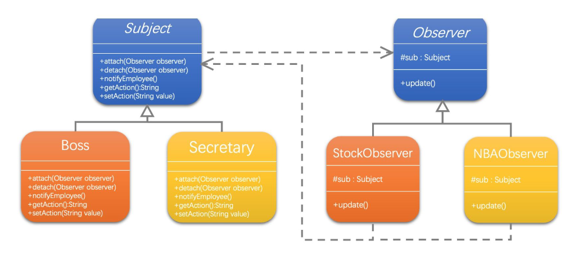
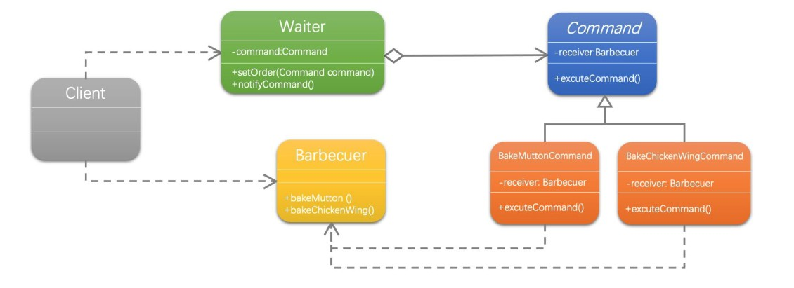

# 行为型模式

## 1.优点

提供创建对象的机制，能够提升已有代码的灵活性和可复用性

## 2.策略模式

案例：设计一个超市收银

首先不考虑规范。

```java
/**
 * 收银-如果使用if else肯定能实现多种折扣，但是也太不方便了
 * @author nisang
 * 2024/2/1 9:10
 * @version 1.0
 * Ruoyi-Cloud-Plus开发小组
 */

public class CashRegister {
    public static void main(String[] args) {
        Scanner sc = new Scanner(System.in);
        System.out.println("请输入折扣");
        //折扣
        double discount=Double.parseDouble(sc.next())/10;
        //数量
        System.out.println("请输入数量");
        int sum=Integer.parseInt(sc.next());
        //单价
        System.out.println("请输入单价");
        double price=Integer.parseInt(sc.next());
        //计算总价
        double v = (sum * price) * discount;
        System.out.println("总消费为："+v);
    }
}
```

当然如果是这样，后期如果打折或者满减优惠无法扩展，甚至耦合代码。

### 2.1UML类图


### 2.2策略模式

```java
/**
 * 收费抽象类
 * @author nisang
 * 2024/2/1 11:02
 * @version 1.0
 * Ruoyi-Cloud-Plus开发小组
 */
public abstract class AbstractCashSuper {

    /**
     * 收取费用的抽象方法
     *
     * @param price 价格
     * @param num   数量
     * @return the double
     */
    public abstract double accept(double price,int num);
}
```

### 2.3具体业务实现类

```java
/**
 * 正常收费
 * @author nisang
 * 2024/2/1 11:04
 * @version 1.0
 * Ruoyi-Cloud-Plus开发小组
 */
public class CashNormal extends AbstractCashSuper {
    @Override
    public double accept(double price, int num) {
        return price*num;
    }
}


/**
 * 打折类
 * @author nisang
 * 2024/2/1 11:05
 * @version 1.0
 * Ruoyi-Cloud-Plus开发小组
 */
public class CashRebate extends AbstractCashSuper {
    private double moneyRebate=1d;

    public CashRebate(double moneyRebate) {
        this.moneyRebate = moneyRebate;
    }

    @Override
    public double accept(double price, int num) {
        return price*num*this.moneyRebate;
    }


}

/**
 * 消费返现类
 *
 * @author nisang
 * 2024/2/1 11:08
 * @version 1.0
 * Ruoyi-Cloud-Plus开发小组
 */
public class CashReturn extends AbstractCashSuper {
    /**
     * 返利条件
     */
    private double moneyCondition = 0d;
    /**
     * 返利值
     */
    private double moneyReturn = 0d;

    /**
     * 返利条件：消费200 减20块钱
     *
     * @param moneyCondition
     * @param moneyReturn
     */
    public CashReturn(double moneyCondition, double moneyReturn) {
        this.moneyCondition = moneyCondition;
        this.moneyReturn = moneyReturn;
    }

    @Override
    public double accept(double price, int num) {
        double result = price * num;
        if (moneyCondition > 0 && result > moneyCondition) {
            result = result - Math.floor(result / moneyCondition) * moneyReturn;
        }
        return result;
    }
}


```

### 2.4上下文

```java
/**
 * 上下文获取折扣类型
 *
 * @author nisang
 * 2024/2/1 13:05
 * @version 1.0
 * Ruoyi-Cloud-Plus开发小组
 */
public class CashContext {

    private AbstractCashSuper abstractCashSuper;

    /**
     * 策略跟工厂模式结合
     *
     * @param cashType
     */
    public CashContext(int cashType) {
        switch (cashType) {
            case 1:
                this.abstractCashSuper = new CashNormal();
                break;
            case 2:
                this.abstractCashSuper = new CashRebate(100);
                break;
            case 3:
                this.abstractCashSuper = new CashReturn(200, 20);
                break;
            default:
        }
    }

    /**
     * 根据收费策略不同，计算不同的结果
     *
     * @param price 价格
     * @param num   数量
     * @return 结果
     */
    public double getResult(double price, int num) {
        return this.abstractCashSuper.accept(price, num);
    }
}


```

### 2.5测试类

```java
/**
 * 使用策略获取上下文，以及工厂优化条件
 * @author nisang
 * 2024/1/13 20:20
 * @version 1.0
 * Ruoyi-Cloud-Plus开发小组
 */
public class ShoppingTest {

    private static final Logger logger = LoggerFactory.getLogger(CashTest.class);

    public static void main(String[] args) {
        CashContext cashContext = new CashContext(1);
        double result = cashContext.getResult(100, 2);
        logger.info("收银："+result);
    }
}
```

当然这个里面的Context获取业务对象，使用了简单工厂模式。

## 3.观察者模式

案例：

老板出去，员工在公司摸鱼，前台负责盯梢，模拟通知员工以及老板发现员工摸鱼。

```java
/**
 * 前台秘书类
 * @author nisang
 * 2024/2/5 10:26
 * @version 1.0
 * Ruoyi-Cloud-Plus开发小组
 */
public class Secretary {

    protected String name;

    public Secretary(String name) {
        this.name = name;
    }

    /**
     * 同事列表
     */
    private ArrayList<StockObserver>observerArrayList=new ArrayList<StockObserver>();

    private String action;

    /**
     * 增加通知的同事对象
     * @param observer 观察者
     */
    public void attach(StockObserver observer){
        observerArrayList.add(observer);
    }

    /**
     * 通知职员.
     */
    public void notifyEmployee(){
        for (StockObserver stockObserver : observerArrayList) {
            stockObserver.update();
        }
    }

    /**
     * 得到状态
     * @return action
     */
    public String getAction() {
        return action;
    }

    /**
     * 设置状态
     * @param action 状态
     */
    public void setAction(String action) {
        this.action = action;
    }
}

```

看股票的同事

```java
/**
 * 看股票同事类
 *
 * @author nisang
 * 2024/2/5 10:27
 * @version 1.0
 * Ruoyi-Cloud-Plus开发小组
 */
public class StockObserver {
    private String name;

    private Secretary sub;

    public StockObserver(String name, Secretary sub) {
        this.name = name;
        this.sub = sub;
    }

    public void update(){
        System.out.println(this.sub.name+"："+this.sub.getAction()+"! "+this.name+",请关闭股票行情，赶紧工作。");
    }
}

```

测试

```
/**
 * @author nisang
 * 2024/2/5 10:35
 * @version 1.0
 * Ruoyi-Cloud-Plus开发小组
 */
public class OriginTest {
    public static void main(String[] args) {
        //前台
        Secretary secretary = new Secretary("童子喆");

        //看股票的同事
        StockObserver stockObserver1 = new StockObserver("魏冠茶", secretary);
        StockObserver stockObserver2 = new StockObserver("李四", secretary);

        //前台登记2个同事
        secretary.attach(stockObserver1);
        secretary.attach(stockObserver2);

        //当发现老板回来时
        secretary.setAction("老板回来了");

        //通知
        secretary.notifyEmployee();

    }
}
```

### 3.1UML类图



### 3.2观察者基类

```java
/**
 * 观察者基类
 * @author nisang
 * 2024/2/5 10:41
 * @version 1.0
 * Ruoyi-Cloud-Plus开发小组
 */
public abstract class BaseObserver {
    protected String name;
    protected BaseSubject sub;

    public BaseObserver(String name, BaseSubject sub) {
        this.name = name;
        this.sub = sub;
        registerToSubject();
    }

    /**
     * 防止重复注册
     */
    protected void registerToSubject() {
        sub.attach(this);
    }
    /**
     * 通知
     */
    public abstract void  update();
}
```

### 3.3主题类

```java
/**
 * 抽象通知者(主题)
 *
 * @author nisang
 * 2024/2/5 10:47
 * @version 1.0
 * Ruoyi-Cloud-Plus开发小组
 */
public abstract class BaseSubject {

    public String name;
    /**
     * 同事列表
     */
    private ArrayList<BaseObserver> observerArrayList = new ArrayList<>();

    private String action;

    public BaseSubject(String name) {
        this.name = name;
    }

    /**
     * 增加通知的同事对象
     *
     * @param observer 观察者
     */
    protected void attach(BaseObserver observer) {
        observerArrayList.add(observer);
    }

    /**
     * 减少通知的同事对象
     *
     * @param observer 观察者
     */
    public void detach(BaseObserver observer) {
        observerArrayList.remove(observer);
    }

    /**
     * 通知职员.
     */
    public void notifyEmployee() {
        for (BaseObserver observer : observerArrayList) {
            observer.update();
        }
    }

    /**
     * 得到状态
     *
     * @return action
     */
    public String getAction() {
        return action;
    }

    /**
     * 设置状态
     *
     * @param action 状态
     */
    public void setAction(String action) {
        this.action = action;
    }

}
```

3.4分别实现类

```java
/**
 * @author nisang
 * 2024/2/5 10:48
 * @version 1.0
 * Ruoyi-Cloud-Plus开发小组
 */
public class Boss extends BaseSubject {
    public Boss(String name) {
        super(name);
    }

}
/**
 * 前台秘书类
 *
 * @author nisang
 * 2024/2/5 10:26
 * @version 1.0
 * Ruoyi-Cloud-Plus开发小组
 */
public class Secretary extends BaseSubject {

    public Secretary(String name) {
        super(name);
    }
}


/**
 * 看股票同事类
 *
 * @author nisang
 * 2024/2/5 10:27
 * @version 1.0
 * Ruoyi-Cloud-Plus开发小组
 */
public class StockObserver extends BaseObserver {


    public StockObserver(String name, BaseSubject sub) {
        super(name, sub);
    }

    @Override
    public void update() {
        System.out.println(super.sub.name + "：" + super.sub.getAction() + "! " + super.name + ",请关闭股票行情，赶紧工作。");
    }
}


/**
 * 看电视同事类
 *
 * @author nisang
 * 2024/2/5 10:27
 * @version 1.0
 * Ruoyi-Cloud-Plus开发小组
 */
public class WatchTVObserver extends BaseObserver {


    public WatchTVObserver(String name, BaseSubject sub) {
        super(name, sub);
    }

    @Override
    public void update(){
        System.out.println(this.sub.name+"："+this.sub.getAction()+"! "+this.name+",请关闭电视，赶紧工作。");
    }
}

```

### 3.4测试类

```java
/**
 * @author nisang
 * 2024/1/13 20:37
 * @version 1.0
 * Ruoyi-Cloud-Plus开发小组
 */
public class ObserverTest {
    public static void main(String[] args) {
        BaseSubject boss = new Boss("王老板");

        //看股票的同事
        BaseObserver stockObserver = new StockObserver("张三", boss);
        WatchTVObserver observer = new WatchTVObserver("李四", boss);
        //看电视的同事
        WatchTVObserver tvObserver = new WatchTVObserver("孙悟空", boss);
        //去除通知的人
        boss.detach(stockObserver);
        //老板回来
        boss.setAction("我回来了");
        //通知2个同事
        boss.notifyEmployee();
    }
}
```

### 3.5应用场景

当一个对象的改变需要同时改变其他对象,而且它不知道具体有多少对象有待改变时，应该考虑使用观察者模式

抽象模型有两个方面，其中一方面依赖于另一方面，这时用观察者模式可以将这两者封装在独立的对象中使它们各自独立地改变和复用

观察者模式所做的工作其实就是在解除耦合。让耦合的双方都依赖于抽象，而不是依赖于具体。从而使得各自的变化都不会影响到另外一边

## 4.命令模式

场景应用：烧烤店吃烧烤，有考羊肉串和鸡翅，最终模拟一个这样场景

````java
/**
 * 烧烤类barbecue
 *
 * @author nisang
 * 2024/2/6 13:12
 * @version 1.0
 * Ruoyi-Cloud-Plus开发小组
 */
public class Barbecue {
    /**
     * 烤羊肉串
     */
    public void bakeMutton() {
        System.out.println("烤羊肉串");
    }

    /**
     * 烤鸡翅
     */
    public void bakeChickenWing() {
        System.out.println("烤鸡翅");
    }

    public static void main(String[] args) {
        Barbecue barbecue = new Barbecue();
        barbecue.bakeMutton();
        barbecue.bakeMutton();
        barbecue.bakeMutton();
        barbecue.bakeChickenWing();
        barbecue.bakeMutton();
        barbecue.bakeMutton();
        barbecue.bakeChickenWing();

    }
}
````

### 4.1UML类图



### 4.2抽象命令接口

```java
/**
 * 抽象命令类
 * @author nisang
 * 2024/2/6 13:32
 * @version 1.0
 * Ruoyi-Cloud-Plus开发小组
 */
public abstract class AbstractCommand {

    protected Barbecue receiver;


    public AbstractCommand(Barbecue receiver) {
        this.receiver = receiver;
    }

    /**
     * 执行命令
     */
    public abstract void executeCommand() ;
}
```


### 4.3厨师类

```java
/**
 * 烧烤类barbecue
 *
 * @author nisang
 * 2024/2/6 13:12
 * @version 1.0
 * Ruoyi-Cloud-Plus开发小组
 */
public class Barbecue {
    /**
     * 烤羊肉串
     */
    public void bakeMutton() {
        System.out.println("烤羊肉串");
    }

    /**
     * 烤鸡翅
     */
    public void bakeChickenWing() {
        System.out.println("烤鸡翅");
    }

}
```


### 4.4服务者

```java
/**
 * 服务员类
 * @author nisang
 * 2024/2/6 13:39
 * @version 1.0
 * Ruoyi-Cloud-Plus开发小组
 */
public class Waiter {


    private ArrayList<AbstractCommand> orders=new ArrayList<AbstractCommand>();


    /**
     * 设置订单
     * @param command
     */
    public void setOrder(AbstractCommand command){
        String className = command.getClass().getSimpleName();
        if (className.equals("BakeChickenWingCommand")){
            System.out.println("服务员：鸡翅没了，请点一些其他东西");
        }else {
            this.orders.add(command);
            System.out.println("增加订单："+className+"时间："+getNowTime());
        }
    }
	 /**
     * 撤销订单
     * @param command
     */
    public void cancelOrder(AbstractCommand command){
        String className = command.getClass().getSimpleName();
        orders.remove(command);
        System.out.println("取消订单："+className+" 时间："+getNowTime());
    }

    /**
     * 执行通知
     */
    public void notifyCommand(){
        for (AbstractCommand command : orders) {
            command.executeCommand();
        }
    }

    private String getNowTime(){
        SimpleDateFormat format = new SimpleDateFormat("HH:mm:ss");
        return format.format(new Date());
    }
}

```


### 4.5命令实现类

```java
/**
 *
 * 烤鸡翅命令类
 *
 * @author nisang
 * 2024/2/6 13:36
 * @version 1.0
 * Ruoyi-Cloud-Plus开发小组
 */
public class BakeChickenWingCommand extends AbstractCommand {

    public BakeChickenWingCommand(Barbecue receiver) {
        super(receiver);
    }

    @Override
    public void executeCommand() {
        receiver.bakeChickenWing();
    }
}

```

```java
/**
 *
 * 烤羊肉串命令类
 *
 * @author nisang
 * 2024/2/6 13:36
 * @version 1.0
 * Ruoyi-Cloud-Plus开发小组
 */
public class BakeMuttonCommand extends AbstractCommand {

    public BakeMuttonCommand(Barbecue receiver) {
        super(receiver);
    }

    @Override
    public void executeCommand() {
        receiver.bakeMutton();
    }
}
```


### 4.6测试类

```java
/**
 * @author nisang
 * 2024/2/6 13:41
 * @version 1.0
 * Ruoyi-Cloud-Plus开发小组
 */
public class CommandTest1 {
    public static void main(String[] args) {
        //开店前厨师准备
        Barbecue cook = new Barbecue();
        //羊肉串就位
        AbstractCommand bakeChickenWingCommand= new BakeChickenWingCommand(cook);
        AbstractCommand bakeMuttonCommand= new BakeMuttonCommand(cook);
        //服务员就位
        Waiter waiter = new Waiter();

        //开门营业
        waiter.setOrder(bakeMuttonCommand);
        waiter.setOrder(bakeMuttonCommand);
        waiter.setOrder(bakeMuttonCommand);
        waiter.setOrder(bakeMuttonCommand);
        waiter.setOrder(bakeMuttonCommand);
        waiter.cancelOrder(bakeMuttonCommand);
        waiter.setOrder(bakeChickenWingCommand);
        waiter.notifyCommand();


    }
}

```


