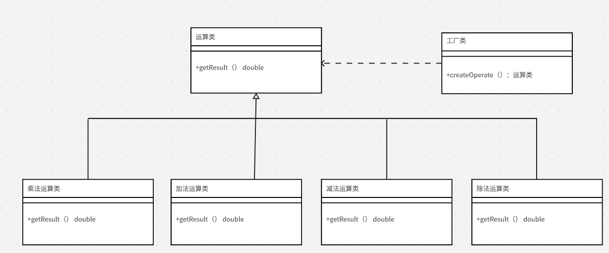

创造型模式

1.优点

提供创建对象的机制，能够提升已有代码的灵活性和可复用性


2.工厂模式

案例：利用java代码，编写一个类似计算器的功能,包括2个数加减乘除的操作

首先不考虑规范，不考虑任何设计模式，一把梭实现代码，好像也没啥问题。

```java
public class Calculator {

    public static void main(String[] args) {
        Scanner sc = new Scanner(System.in);

        System.out.println("请输入第一个数");
        double s1 = Double.parseDouble(sc.next());
        System.out.println("请输入第二个数");
        double s2 = Double.parseDouble(sc.next());

        System.out.println("请输入运算符");
        String s3 = sc.next();

        if (s3.equals("+")) {
            System.out.println(s1 + s2);
        } else if (s3.equals("-")) {
            System.out.println(s1 - s2);
        } else if (s3.equals("*")) {
            System.out.println(s1 * s2);
        } else if (s3.equals("%")) {
            System.out.println(s1 % s2);
        } else {
            System.out.println("输入有误");
        }
    }
}
```

当然如果是这样，如果你是对自己有所要求，肯定无法满足,可以考虑优化一下。

2.1UML类图



2.2简单工厂模式

```java
/**
 *计算器接口
 * @author nisang
 * 2024/1/28 15:10
 * @version 1.0
 * Ruoyi-Cloud-Plus开发小组
 */
public interface Calculator {

    /**
     * 获取结果
     *
     * @param s1 第一个数
     * @param s2 第二个数
     * @return 返回结果
     */
    public double getResult(double s1, double s2);
}
```

具体业务实现类

```java
/**
 * 具体实现类-加法
 * @author nisang
 * 2024/1/28 15:12
 * @version 1.0
 * Ruoyi-Cloud-Plus开发小组
 */
public class CalculatorAdd implements Calculator {
    private static final Logger logger = LoggerFactory.getLogger(CalculatorAdd.class);
    @Override
    public double getResult(double s1, double s2) {
        logger.info("计算结果:{}",s1+s2);
        return s1+s2;
    }
}

/**
 * 具体实现类-减法
 * @author nisang
 * 2024/1/28 15:12
 * @version 1.0
 * Ruoyi-Cloud-Plus开发小组
 */

public class CalculatorSubtract implements Calculator {
    private static final Logger logger = LoggerFactory.getLogger(CalculatorSubtract.class);
    @Override
    public double getResult(double s1, double s2) {
        logger.info("计算结果:{}",s1-s2);
        return s1-s2;
    }
}


/**
 * 具体实现类-乘法
 * @author nisang
 * 2024/1/28 15:12
 * @version 1.0
 * Ruoyi-Cloud-Plus开发小组
 */

public class CalculatorMultiply implements Calculator {
    private static final Logger logger = LoggerFactory.getLogger(CalculatorDivide.class);
    @Override
    public double getResult(double s1, double s2) {
        logger.info("计算结果:{}",s1*s2);
        return s1*s2;
    }
}


/**
 * 具体实现类-除法
 * @author nisang
 * 2024/1/28 15:12
 * @version 1.0
 * Ruoyi-Cloud-Plus开发小组
 */

public class CalculatorDivide implements Calculator {
    private static final Logger logger = LoggerFactory.getLogger(CalculatorDivide.class);
    @Override
    public double getResult(double s1, double s2) {
        logger.info("计算结果:{}",s1%s2);
        return s1%s2;
    }
}

```

工厂类

```java
/**
 * 简单工厂类，负责根据计算器类型创建具体实例
 *
 * @author nisang
 * 2024/1/13 11:29
 * @version 1.0
 * Ruoyi-Cloud-Plus开发小组
 */
public class SimpleFactory {
    /**
     * 根据计算器类型创建实例
     *
     * @param type 计算器指令类型（"+","-","*","%"）
     * @return 具体执行实例
     * @throws IllegalArgumentException 如果传入无效的类型
     */
    public static Calculator createOperate(String type) {
        Calculator calculator;
        switch (type) {
            case CreateConstant.ADD:
                calculator = new CalculatorAdd();
                break;
            case CreateConstant.SUBTRACT:
                calculator = new CalculatorSubtract();
                break;
            case CreateConstant.MULTIPLY:
                calculator = new CalculatorMultiply();
                break;
            case CreateConstant.DIVIDE:
                calculator = new CalculatorDivide();
                break;
            default:
                throw new IllegalArgumentException(CreateConstant.INVALID_PRODUCT_TYPE);
        }
        return calculator;
    }
}

```

测试类

```java
public class SimpleFactoryTest {
    private static final Logger logger = LoggerFactory.getLogger(SimpleFactoryTest.class);
    public static void main(String[] args) {
        Scanner sc = new Scanner(System.in);

        logger.info("请输入第一个数");
        double s1 = Double.parseDouble(sc.next());
        logger.info("请输入第二个数");
        double s2 = Double.parseDouble(sc.next());

        logger.info("请输入运算符");
        String s3 = sc.next();

        Calculator calculator= SimpleFactory.createProduct(s3);
        calculator.calculate(s1,s2);
    }
}
```

