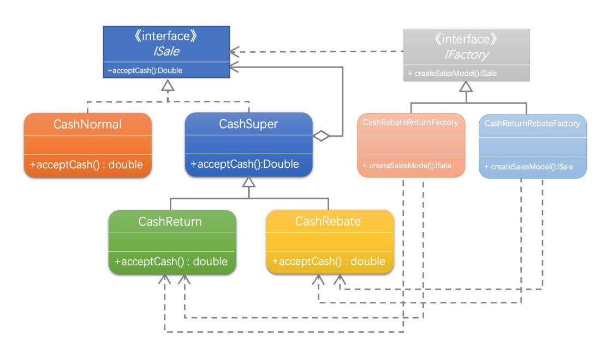

# 结构型模式

## 1.优点


## 2.装饰者模式

实现人装扮

```java
/**
 * 人装扮
 * @author nisang
 * 2024/2/2 12:59
 * @version 1.0
 * Ruoyi-Cloud-Plus开发小组
 */
public class Person {

    public String name;

    public Person(String name) {
        this.name = name;
    }

    public void wearTShirts() {
        System.out.print("大T恤");
    }

    public void wearBigTrouser() {
        System.out.print("垮裤");
    }

    public void wearSneakers() {
        System.out.print("球鞋");
    }

    public void wearSuit() {
        System.out.print("西装");

    }

    public void wearTie() {
        System.out.print("领带");


    }

    public void wearLeatherShoes() {
        System.out.print("皮鞋");

    }

    public void show() {
        System.out.println("装扮的" + name);
    }

    public static void main(String[] args) {
        Person person = new Person("张三");
        System.out.println("第一种装扮");
        person.wearTShirts();
        person.wearBigTrouser();
        person.wearSneakers();
        person.show();
        System.out.println("第二种装扮");
        person.wearSuit();
        person.wearTie();
        person.wearLeatherShoes();
        person.show();
    }
}
```

当然如果是这样，不符合设计模式的思想。

### 2.1UML类图


### 2.2实现component接口

```java
/**
 * 人物形象接口 Component
 *
 * @author nisang
 * 2024/2/2 13:10
 * @version 1.0
 * Ruoyi-Cloud-Plus开发小组
 */
public interface CharacterComponent {

    /**
     * 人物展示
     */
    public void show();
}
```

### 2.3具体人类（concreate）

```java
/**
 * 具体人类
 *
 * @author nisang
 * 2024/2/2 13:12
 * @version 1.0
 * Ruoyi-Cloud-Plus开发小组
 */
public class Person implements CharacterComponent {


    private String name;

    public Person(String name) {
        this.name = name;
    }

    @Override
    public void show() {
        System.out.println("装扮的" + name);
    }
}

```

### 2.4装饰类

```java
/**
 * 服饰装饰者类
 *
 * @author nisang
 * 2024/2/2 13:14
 * @version 1.0
 * Ruoyi-Cloud-Plus开发小组
 */
public class FineryDecorator implements CharacterComponent {

    protected CharacterComponent component;


    /**
     * set CharacterComponent对象
     *
     * @param component the component
     */
    public void decorate(CharacterComponent component) {
        this.component = component;
    }

    @Override
    public void show() {
        if (component != null) {
            component.show();
        }
    }
}
```

### 2.5具体业务实现类

```java
/**
 * 垮裤实际服饰类
 * @author nisang
 * 2024/2/2 13:22
 * @version 1.0
 * Ruoyi-Cloud-Plus开发小组
 */
public class BigTrouser extends FineryDecorator {

    @Override
    public void show() {
        System.out.print("垮裤");
        super.show();
    }
}


/**
 * 皮鞋实际服饰类
 * @author nisang
 * 2024/2/2 13:24
 * @version 1.0
 * Ruoyi-Cloud-Plus开发小组
 */
public class LeatherShoes extends FineryDecorator {
    @Override
    public void show() {
        System.out.print("皮鞋");
        super.show();
    }
}
/**
 * 球鞋实际服饰类
 * @author nisang
 * 2024/2/2 13:23
 * @version 1.0
 * Ruoyi-Cloud-Plus开发小组
 */
public class Sneakers extends FineryDecorator {
    @Override
    public void show() {
        System.out.print("球鞋");
        super.show();
    }
}

/**
 * 西装实际服饰类
 * @author nisang
 * 2024/2/2 13:23
 * @version 1.0
 * Ruoyi-Cloud-Plus开发小组
 */
public class Suit extends FineryDecorator {
    @Override
    public void show() {
        System.out.print("西装");
        super.show();
    }
}
/**
 * 领带实际服饰类
 * @author nisang
 * 2024/2/2 13:23
 * @version 1.0
 * Ruoyi-Cloud-Plus开发小组
 */
public class Tie extends FineryDecorator {
    @Override
    public void show() {
        System.out.print("领带");
        super.show();
    }
}
/**
 * T恤实际服饰类
 * @author nisang
 * 2024/2/2 13:20
 * @version 1.0
 * Ruoyi-Cloud-Plus开发小组
 */
public class TShirts extends FineryDecorator {
    @Override
    public void show() {
        System.out.print("大T恤");
        super.show();
    }
}

```

### 2.6测试类

```java

/**
 * @author nisang
 * 2024/2/2 13:27
 * @version 1.0
 * Ruoyi-Cloud-Plus开发小组
 */
public class DecoratorTest {
    private static final Logger logger = LoggerFactory.getLogger(DecoratorTest.class);

    public static void main(String[] args) {
        Person p = new Person("小菜");
        logger.info("第一种装扮");
        //T恤
        TShirts tShirts = new TShirts();
        //垮裤
        BigTrouser bigTrouser = new BigTrouser();
        //球鞋
        Sneakers sneakers = new Sneakers();


        tShirts.decorate(p);
        bigTrouser.decorate(tShirts);
        sneakers.decorate(bigTrouser);
        sneakers.show();

        //第二种装扮跟这个差不多
        logger.info("第二种装扮");
        //西装
        Suit suit = new Suit();
        //领带
        Tie tie = new Tie();
        //皮鞋
        LeatherShoes leatherShoes = new LeatherShoes();

        suit.decorate(p);
        tie.decorate(suit);
        leatherShoes.decorate(tie);
        leatherShoes.show();
    }
}
```

优化超市案例，使用策略+工厂+装饰模式


代码如下:

```java
/**
 * @author nisang
 * 2024/2/2 13:53
 * @version 1.0
 * Ruoyi-Cloud-Plus开发小组
 */
public interface Sale {

    /**
     * 收取费用的抽象方法
     *
     * @param price 价格
     * @param num   数量
     * @return the double
     */
    public abstract double acceptCash(double price,int num);
}


/**
 * 正常收费
 * @author nisang
 * 2024/2/1 11:04
 * @version 1.0
 * Ruoyi-Cloud-Plus开发小组
 */
public class CashNormal implements Sale {

    @Override
    public double acceptCash(double price, int num) {
        return price*num;
    }
}

/**
 * 打折类
 * @author nisang
 * 2024/2/1 11:05
 * @version 1.0
 * Ruoyi-Cloud-Plus开发小组
 */
public class CashRebate extends CashSuperDecorator {
    private double moneyRebate=1d;

    public CashRebate(double moneyRebate) {
        this.moneyRebate = moneyRebate;
    }


    @Override
    public double acceptCash(double price, int num) {
        double result = price * num * this.moneyRebate;
        return super.acceptCash(result,1) ;
    }
}

/**
 * 消费返现类
 *
 * @author nisang
 * 2024/2/1 11:08
 * @version 1.0
 * Ruoyi-Cloud-Plus开发小组
 */
public class CashReturn extends CashSuperDecorator {
    /**
     * 返利条件
     */
    private double moneyCondition = 0d;
    /**
     * 返利值
     */
    private double moneyReturn = 0d;

    /**
     * 返利条件：消费200 减20块钱
     *
     * @param moneyCondition 消费金额条件
     * @param moneyReturn    返现值
     */
    public CashReturn(double moneyCondition, double moneyReturn) {
        this.moneyCondition = moneyCondition;
        this.moneyReturn = moneyReturn;
    }

    @Override
    public double acceptCash(double price, int num) {
        double result = price * num;
        if (moneyCondition > 0 && result > moneyCondition) {
            result = result - Math.floor(result / moneyCondition) * moneyReturn;
        }
        return super.acceptCash(result,1);
    }
}

/**
 * 收费抽象类
 *
 * @author nisang
 * 2024/2/1 11:02
 * @version 1.0
 * Ruoyi-Cloud-Plus开发小组
 */
public class CashSuperDecorator implements Sale {

    protected Sale component;

    public void decorate(Sale component) {
        this.component = component;
    }

    @Override
    public double acceptCash(double price, int num) {
        double result = 0d;
        if (component != null) {
            //若装饰对象存在，则执行装饰对象的算法运算
            result = component.acceptCash(price, num);
        }
        return result;
    }
}


/**
 * 上下文获取折扣类型
 *
 * @author nisang
 * 2024/2/1 13:05
 * @version 1.0
 * Ruoyi-Cloud-Plus开发小组
 */
public class CashContext {

    private Sale component;

    /**
     * 策略跟工厂模式结合
     *
     * @param cashType
     */
    public CashContext(int cashType) {
        switch (cashType) {
            case Constant.CASH_STRATEGY_NORMAL:
                this.component = new CashNormal();
                break;
            case Constant.CASH_STRATEGY_REBATE:
                this.component = new CashRebate(100d);
                break;
            case Constant.CASH_STRATEGY_RETURN:
                this.component = new CashReturn(200d, 20d);
                break;
            case Constant.CASH_STRATEGY_RETURN_REBATE:
                //先满200减10，再打9折
                CashNormal cashNormal = new CashNormal();
                CashReturn cashReturn = new CashReturn(200d,10d);
                CashRebate cashRebate = new CashRebate(0.9d);

                cashReturn.decorate(cashNormal);
                cashRebate.decorate(cashReturn);
                this.component=cashRebate;
                break;
            case Constant.CASH_STRATEGY_REBATE_RETURN:
                //先打9折，再满200减10
                CashNormal normal = new CashNormal();
                CashRebate rebate = new CashRebate(0.9d);
                CashReturn aReturn = new CashReturn(200d,10d);

                rebate.decorate(normal);
                aReturn.decorate(rebate);
                this.component=aReturn;
                break;
            default:
        }
    }

    /**
     * 根据收费策略不同，计算不同的结果
     *
     * @param price 价格
     * @param num   数量
     * @return 结果
     */
    public double getResult(double price, int num) {
        return this.component.acceptCash(price, num);
    }
}


/**
 * 使用策略+工厂+装饰者模式
 * @author nisang
 * 2024/1/13 20:20
 * @version 1.0
 * Ruoyi-Cloud-Plus开发小组
 */
public class ShoppingTest {

    private static final Logger logger = LoggerFactory.getLogger(CashTest.class);

    public static void main(String[] args) {
        CashContext cashContext = new CashContext(Constant.CASH_STRATEGY_RETURN_REBATE);
        double result = cashContext.getResult(300, 2);
        logger.info("收银："+result);
    }
}
```

再次升级，工厂方法+策略+装饰者



代码如下：增加工厂方法

```java
/**
 * @author nisang
 * 2024/2/4 16:44
 * @version 1.0
 * Ruoyi-Cloud-Plus开发小组
 */
public interface SaleFactory {


    /**
     * 商场返利工厂
     *
     * @return the sale
     */
    public Sale createSalesModel();

}

/**
 * 先打折再满减工厂类
 *
 * @author nisang
 * 2024/2/4 16:46
 * @version 1.0
 * Ruoyi-Cloud-Plus开发小组
 */
public class CashRebateReturnFactory implements SaleFactory {
    /**
     * 打折值
     */
    private double moneyRebate = 1d;

    /**
     * 返利条件
     */
    private double moneyCondition = 0d;
    /**
     * 返利值
     */
    private double moneyReturn = 0d;

    /**
     * 打折方法
     *
     * @param moneyRebate    打折值
     * @param moneyCondition 返利条件
     * @param moneyReturn    返利值
     */
    public CashRebateReturnFactory(double moneyRebate, double moneyCondition, double moneyReturn) {
        this.moneyRebate = moneyRebate;
        this.moneyCondition = moneyCondition;
        this.moneyReturn = moneyReturn;
    }

    /**
     * 先打x折，再满m减n
     * @return
     */
    @Override
    public Sale createSalesModel() {
        //先打9折，再满200减10
        CashNormal normal = new CashNormal();
        CashRebate rebate = new CashRebate(this.moneyRebate);
        CashReturn aReturn = new CashReturn(this.moneyCondition,this.moneyReturn);

        rebate.decorate(normal);
        aReturn.decorate(rebate);
        return aReturn;
    }
}


/**
 * 先满减再打折工厂类
 *
 * @author nisang
 * 2024/2/4 16:46
 * @version 1.0
 * Ruoyi-Cloud-Plus开发小组
 */
public class CashReturnRebateFactory implements SaleFactory {
    /**
     * 打折值
     */
    private double moneyRebate = 1d;

    /**
     * 返利条件
     */
    private double moneyCondition = 0d;
    /**
     * 返利值
     */
    private double moneyReturn = 0d;

    /**
     * 打折方法
     *
     * @param moneyRebate    打折值
     * @param moneyCondition 返利条件
     * @param moneyReturn    返利值
     */
    public CashReturnRebateFactory(double moneyRebate, double moneyCondition, double moneyReturn) {
        this.moneyRebate = moneyRebate;
        this.moneyCondition = moneyCondition;
        this.moneyReturn = moneyReturn;
    }

    /**
     * 先满m减n，再打x折
     * @return
     */
    @Override
    public Sale createSalesModel() {
        //先满200减10，再打9折
        CashNormal cashNormal = new CashNormal();
        CashReturn cashReturn = new CashReturn(this.moneyCondition,this.moneyReturn);
        CashRebate cashRebate = new CashRebate(this.moneyRebate);

        cashReturn.decorate(cashNormal);
        cashRebate.decorate(cashReturn);
        return cashRebate;
    }
}

/**
 * 上下文获取折扣类型
 *
 * @author nisang
 * 2024/2/1 13:05
 * @version 1.0
 * Ruoyi-Cloud-Plus开发小组
 */
public class CashContext {

    private Sale component;

    /**
     * 策略跟工厂模式结合
     *
     * @param cashType
     */
    public CashContext(int cashType) {
        SaleFactory fs = null;
        switch (cashType) {
            case Constant.CASH_STRATEGY_NORMAL:
                fs = new CashReturnRebateFactory(1d, 0d, 0d);
                break;
            case Constant.CASH_STRATEGY_REBATE:
                fs = new CashReturnRebateFactory(0.8d,0d,0d);
                break;
            case Constant.CASH_STRATEGY_RETURN:
                fs = new CashReturnRebateFactory(1d, 200d, 20d);
                break;
            case Constant.CASH_STRATEGY_RETURN_REBATE:
                //先满200减10，再打9折
                fs = new CashReturnRebateFactory(0.9d, 200, 10);
                break;
            case Constant.CASH_STRATEGY_REBATE_RETURN:
                //先打9折，再满200减10
                fs = new CashRebateReturnFactory(0.9d, 200, 10);
                break;
            default:
                throw new RuntimeException(Constant.INVALID_PRODUCT_TYPE);
        }
        this.component=fs.createSalesModel();
    }

    /**
     * 根据收费策略不同，计算不同的结果
     *
     * @param price 价格
     * @param num   数量
     * @return 结果
     */
    public double getResult(double price, int num) {
        return this.component.acceptCash(price, num);
    }
}
```


## 3.代理模式

模仿追求者给被追求者送花

```java
/**
 * 追求者
 *
 * @author nisang
 * 2024/2/3 12:05
 * @version 1.0
 * Ruoyi-Cloud-Plus开发小组
 */
public class Pursuit {

    private SchoolGirl mm;

    public Pursuit(SchoolGirl mm) {
        this.mm = mm;
    }

    public void giveDolls() {
        System.out.println(this.mm.getName() +",你好，送你洋娃娃。");
    }

    public void giveFlowers() {
        System.out.println(this.mm.getName() +",你好，送你鲜花。");
    }

    public void giveChocolate() {
        System.out.println(this.mm.getName() +",你好，送你巧克力。");
    }

    public static void main(String[] args) {
        SchoolGirl girl = new SchoolGirl();
        girl.setName("李娇娇");

        Pursuit boyFriend = new Pursuit(girl);
        boyFriend.giveDolls();
        boyFriend.giveChocolate();
        boyFriend.giveFlowers();

    }
}

/**
 * 被追求者
 * @author nisang
 * 2024/2/3 12:07
 * @version 1.0
 * Ruoyi-Cloud-Plus开发小组
 */
public class SchoolGirl {

    private String name;

    public String getName() {
        return name;
    }

    public void setName(String name) {
        this.name = name;
    }
}

```

### 3.1UML类图


### 3.2实现接口

```java

/**
 * 送礼物接口
 *
 * @author nisang  2024/2/3 16:24
 * @version 1.0  Ruoyi-Cloud-Plus开发小组
 */
public interface GiveGift {

    /**
     * Give dolls.
     */
    public void giveDolls() ;

    /**
     * Give flowers.
     */
    public void giveFlowers() ;

    /**
     * Give chocolate.
     */
    public void giveChocolate() ;
}
```

### 3.3代理类

```java
/**
 * 追求者
 *
 * @author nisang
 * 2024/2/3 12:05
 * @version 1.0
 * Ruoyi-Cloud-Plus开发小组
 */
public class Proxy implements GiveGift {
    /**
     * 追求者对象
     */
    private Pursuit pursuit;

    public Proxy(SchoolGirl mm) {
        this.pursuit = new Pursuit(mm);
    }

    @Override
    public void giveDolls() {
        this.pursuit.giveDolls();
    }

    @Override
    public void giveFlowers() {
        this.pursuit.giveFlowers();
    }

    @Override
    public void giveChocolate() {
        this.pursuit.giveChocolate();
    }
}
```

### 3.4追求者类

```java
/**
 * 追求者
 *
 * @author nisang
 * 2024/2/3 12:05
 * @version 1.0
 * Ruoyi-Cloud-Plus开发小组
 */
public class Pursuit implements GiveGift {

    private SchoolGirl mm;

    public Pursuit(SchoolGirl mm) {
        this.mm = mm;
    }

    @Override
    public void giveDolls() {
        System.out.println(this.mm.getName() + ",你好，送你洋娃娃。");
    }

    @Override
    public void giveFlowers() {
        System.out.println(this.mm.getName() + ",你好，送你鲜花。");
    }

    @Override
    public void giveChocolate() {
        System.out.println(this.mm.getName() + ",你好，送你巧克力。");
    }

}
```

### 3.5测试类

```java
/**
 * 远程代理，也就是为一个对象在不同的地址空间提供局部代表。这样可以隐藏一个对象存在于不同地址空间的事实
 * 虚拟代理，是根据需要创建开销很大的对象。通过它来存放实例化需要很长时间的真实对象
 * 安全代理，用来控制真实对象访问时的权限
 * 智能指引，是指当调用真实的对象时，代理处理另外一些事
 * @author nisang
 * 2024/2/3 16:29
 * @version 1.0
 * Ruoyi-Cloud-Plus开发小组
 */
public class ProxyTest {
    public static void main(String[] args) {
        SchoolGirl girl = new SchoolGirl();
        girl.setName("李娇娇");

        Proxy proxy = new Proxy(girl);
        proxy.giveFlowers();
        proxy.giveDolls();
        proxy.giveChocolate();
    }
}
```


